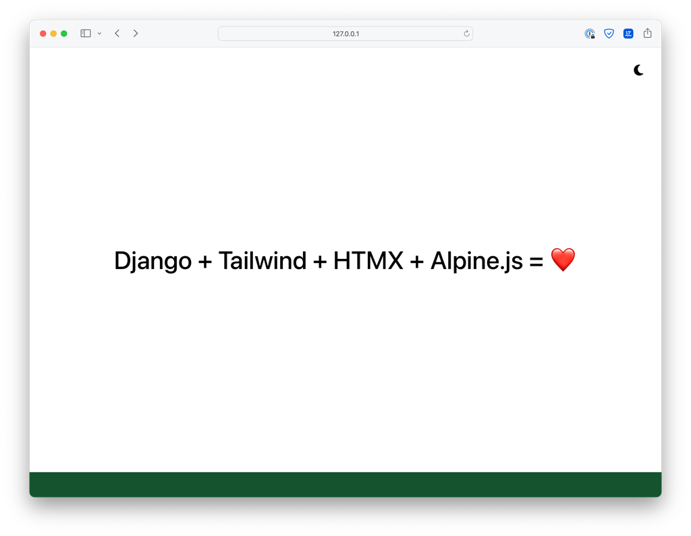

# django-poetry-startproject

[](https://github.com/psf/black)

[](https://pdm.fming.dev)



> Django startproject template using pdm as package and dependency manager.

I took the inspiration from Jeff Triplett's [django-startproject](https://github.com/jefftriplett/django-startproject) and created my own starter for a fresh django project. It includes even more batteries than Jeff's. 🤷‍♂️

It has no Postgres support included out of the box, because I am currently enjoying SQLite a lot for the small services I am building with this starter. And SQLite is impressive in WAL mode. But it is super easy to add Postgres or MySQL support. See below.

## Features

- Django 4.1.x
- django-click
- django-environ
- whitenoise
- django-htmx
- django-tailwind-cli
- django-ninja
- django-health-check
- SQLite setup with WAL mode enabled
- Local install of htmx
- Local install of Alpine.js

### CI

- django-browser-reload
- django-test-plus
- django-types
- model-bakery
- pre-commit setup inspired by [Boost your Django DX](https://adamchainz.gumroad.com/l/byddx)
- pytest
- pytest-cov
- pytest-django
- pytest-randomly
- pytest-timeout
- sane ruff configuration in pyproject.toml

## Install

```shell
django-admin startproject \
    --extension=ini,py,toml,yaml,yml \
    --template=https://github.com/oliverandrich/django-poetry-startproject/archive/main.zip \
    example_project

# Setup environment
cd example_project
echo "DJANGO_DEBUG=True" >> .env
echo "SECRET_KEY=notsosecret" >> .env

# Install dependencies
pdm install

# Migrate database
pdm run manage.py migrate

# Start tailwind server
pdm run manage.py tailwind watch

# Start dev server
pdm run manage.py runserver
```

### Add Postgres support

```shell
cd example_project
pdm add psycopg2-binary
```

Set the environment variable DATABASE_URL to [something reasonable](https://django-environ.readthedocs.io/en/latest/types.html#environ-env-db-url)

### Add MySQL support

```shell
cd example_project
pdm add django-mysql
```

Follow the [installation instructions](https://django-mysql.readthedocs.io/en/latest/installation.html#id1) of `django-mysql` and set the environment variable DATABASE_URL to [something reasonable](https://django-environ.readthedocs.io/en/latest/types.html#environ-env-db-url)

## Contributing

Contributions, issues and feature requests are welcome!
Feel free to check [issues page](https://github.com/oliverandrich/django-poetry-startproject/issues).

## TODO

- Docker and docker-compose support
